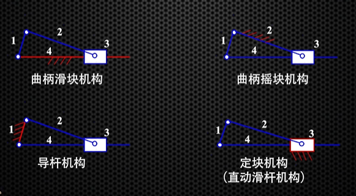
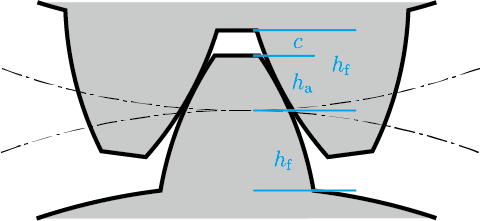

机械原理

[TOC]

$ 
\newcommand{\ve}[1]{\boldsymbol{\mathbf{#1}}}
\newcommand{\unit}[1]{\boldsymbol{\mathbf{\hat{#1}}}}
\newcommand{\mr}{\mathrm}
\newcommand{\mcal}{\mathcal}
\newcommand{\mscr}{\mathscr}
\newcommand{\E}{\mathrm e}
\renewcommand{\I}{\mathrm i}
\newcommand{\R}{\mathbb R}
\newcommand{\Z}{\mathbb Z}
\newcommand{\N}{\mathbb N}
\newcommand{\Q}{\mathbb Q}
\newcommand{\C}{\mathbb C}
\def \DD #1.#2.#3 {\dfrac{d^{#1} #2}{d #3^{#1}}}
\def \PP #1.#2.#3 {\dfrac{\partial^{#1} #2}{\partial #3^{#1}}}
\def \dd #1.#2 {\dfrac{d #1}{d #2}}
\def \pp #1.#2 {\dfrac{\partial #1}{\partial #2}} 
\newcommand{\transp}{^{\top}}
\DeclareMathOperator{\tr}{tr}
\let\Im\Relax
\let\Re\Relax
\DeclareMathOperator{\Im}{Im}
\DeclareMathOperator{\Re}{Re}
$

# 机构的结构分析
## 机构的组成
机器 (machine): 变换或传递能量、物料和信息的执行机械运动的装置
机构 (mechanism): 传递与变换运动和力的装置
构件 (link): 机器中每一个独立的运动单元体
零件: 生产加工的(最小)基本单元

四者的关系: 机器 $ \Leftarrow $ 机构 $ \Leftarrow $ 构件 $ \Leftarrow $ 零件

## 运动副, 运动链与机构
**构件**通过**运动副 (kinematic pair) 的连接**构成了**可相对运动的运动链 (kinematic chain)**, 运动链中的某一机构被固定成机架 (fixed link) 后, 该运动链便成为机构. 运动链与机构的主要区别在于: 由于机构中固定机架的存在, 可以建立参考系, 以描述各构件的运动; 而运动链不存在参考系. 

### 原动件和从动件
机构中, 按已给定的已知运动规律**独立运动**的构件称为原动件 (driving link), 也称主动件; 而其余活动构件因原动件的运动和运动副的连接而产生运动, 称为从动件 (drived link).

### 运动副的分类
- 按提供的约束数: 约束度为 1 称 I 级副, 约束度为 2 称 II 级副, 以此类推
- 按接触情况: 通过**点、线接触**构成的统称为**高副 (higher pair)**, 通过**面接触**的称为**低副 (lower pair)**
- 按相对运动方式: 转动副 (revolute pair), 移动副 (prismatic pair), 螺旋副 (helical pair), 球面副 (spherical pair)

> 构成运动副的构件之间必须始终保持接触. 没有接触, 就不叫运动副.

> **转动副**和**移动副**为单自由度最简单的运动, 故将其称为基本运动副 (basic pair).

### 构件的自由度
两构件在未形成运动副时, 在空间中它们有 6 个相对自由度, 在平面内则有 3 个自由度. 两构件形成运动副后, 它们的相对运动会受到约束, 自由度会减小.

运动副带来的约束度为 1 到 5. 

> 约束度为 6, 则两构件无法发生相对运动, 按照构件的定义: 机构中各构件存在相对运动. 所以此时两个构件实际上形成一个构件.

> 运动副约束后, 两构件的相对运动可以不独立, 参考螺旋副和圆柱副.

## 机构自由度(degree of freedom, DOF)
### 机构具有确定运动的条件
- 原动件数 $ > $ 机构自由度: 机构薄弱环节可能损坏
- 原动件数 $ = $ 机构自由度: 机构有确定运动
- 原动件数 $ < $ 机构自由度: 运动不确定, 优先沿阻力最小方向运动

### 机构自由度
设平面机构中共有 $ n $ 个活动构件, 在各构件尚未用运动副连接时, 它们共有 $ 3n $ 个自由度.

当各构件用运动副( $ p_\ell $ 个低副, $ p_\mathrm{h} $ 个高副), 它们提供的约束为 $ 2 p_\ell + p_\mathrm{h} $. 
也即: <u>**低副提供 2 个约束, 高副提供 1 个约束.**</u>

所以总的自由度:
\[ F = 3 n - (2 p_\ell + p_{\rm h}) .\]

总自由度 $ F \leqslant 0 $ 时, 整体无法运动, 因而不构成机构.

### 正确计算运动副的数目
$ n $ 个构件形成的复合铰链有 $ n - 1 $ 个低副.

### 去除局部自由度
如果一个构件自身的运动不影响其他构件的运动, 则称该构件的具有局部自由度. 在计算时, 应在最后结果中减去局部自由度.

### 去除虚约束
- 构件上两点在运动中距离不变, 则这两点上的约束是虚约束
- 低副
  - 两构件-多个转动副
    - 轴线重合: 虚约束
    - 不重合: 有效约束
  - 两构件-多个移动副
    - 轴线共面: 虚约束
    - 异面(不平行$ \land $不重合): 有效约束
- 高副
  - 公法线重合: 虚约束 
  - 不重合: 有效约束

设虚约束 $ p' $, 局部自由度 $ F' $:
\[ F = 3 n - (2 p_\ell + p_\mathrm h - p') - F' \,.\]

## 机构分类
机构可分为 3 部分
- 机架 ($ F = 0 $)
- 原动件 ($ F = F $)
- 基本杆组 (**不能再拆分的最简单的自由度为零的杆组**)

设基本杆组由 $ n $ 个构件构成, 有 $ p_\ell $ 个低副, $ 0 $ 个高副. 则根据机构具有确定运动的条件, $ 3 n - 2 p_\ell = 0 \Rightarrow n = \dfrac{2}{3} p_\ell $. 因此为简单的基本杆组进行分类,

$ n $ | $ p_\ell $ | 名称
:-:|:-:|:-:
2 | 3 | II 级组
4 | 6 | III 级组
6 | 9 | IV 级组

只由机架, 原动件构成 I 级机构.

# 连杆机构
## 平面四杆机构
### 基本形式
1. 曲柄摇杆
2. 双曲柄
3. 双摇杆
### 演化形式
1. 曲柄滑块
   将摇杆长度增至无穷大, 曲线导轨变成直线导轨

2. 双滑块 (正弦机构)
   
3. 偏心轮
4. 导杆   

## 曲柄存在的条件
### 杆长条件
四杆机构中, **最长与最短杆长之和 $ \leqslant $ 其余两杆之和** 的条件被称为**杆长条件**.

### 曲柄存在判定
- 不满足杆长条件: 双摇杆 
- 满足杆长条件
  - 机架最短: 双曲柄
  - 连架杆最短: 曲柄摇杆
  - 连杆最短: 双摇杆

可以总结出曲柄存在的条件:
1. 满足**杆长条件**
2. 与转动副相连的两杆存在最短杆 (**短杆条件**)

## 平面四杆机构及其演化形式
### 演化形式
1. 改变构件的形状和运动尺寸
   - 曲柄摇杆 $ \Rightarrow $ 摇杆增加到无穷大 $ \Rightarrow $ **曲柄<u>滑块</u>**
    

   - 曲柄滑块 $ \Rightarrow $ 连杆无穷大 $ \Rightarrow $ **正弦机构**
    

2. 取不同构件为机架
曲柄滑块机构中取不同构件作机架
   - **曲柄<u>摇块</u>** (以转动副连接滑块的杆作机架)
   - **<u>定块</u>机构(直动滑杆)** (以滑块作机架)
   - **<u>导杆</u>机构** (以不与滑块相连的杆作机架)
     - 摆动导杆
     - 转动导杆

3. 改变运动副尺寸
如偏心轮

### 总结
基本形式和演化形式
- 双曲柄
- 双摇杆
- 曲柄摇杆
  - 曲柄滑块 (摇杆尺寸 $ \infty $)
    - 曲柄摇块 (曲柄滑块改变机架)
    - 定块机构 (同上)
    - 导杆机构 (同上)
  - 正弦机构

### 曲柄滑块机构连架杆能转一圈的条件
曲柄长 $ + $ 偏距 $ \leqslant $ 连杆长

## 急回运动
曲柄极限位置: 曲柄与连杆共线

分析两个极限位置, 设曲柄匀速顺时针转动, 从蓝色到黄色为第一个过程, 从黄色转会蓝色为第二个过程. 两个过程, 曲柄转角满足 $ \alpha_1 > \alpha_2 $; 花费时间 $ t_1 > t_2 $. 摇杆两个阶段转过的角度均为 $ \beta $.

两个阶段摇杆运动速度: $ \omega_1 = \beta / t_1 $, $ \omega_2 = \beta / t_2 $. 可以看出: $ \omega_1 < \omega_2 $.

用大的速度比上小的速度, 得到行程速度变化系数 $ K $:
\[ K = \dfrac{\omega_M}{\omega_m} = \dfrac{\omega_2}{\omega_1} = \dfrac{t_1}{t_2} = \dfrac{\alpha_1}{\alpha_2} \,,\]

可以看出, $ K \geqslant 1 $, 求法很简单, 即两个阶段曲柄转角中大的比上小的. $ K = 1 $ 代表无急回; $ K > 1 $ 则有急回, $ K $ 越大, 急回效果越明显.

### 极位夹角
两个极限位置曲柄所夹锐角称为极位夹角, 记作 $ \theta $, 如上图所示. 下面记两个阶段转角中较大的和较小的为 $ \alpha_1 $ 和 $ \alpha_2 $, 即 $ \alpha_1 > \alpha_2 $.

- 按照定义, 当 $ \alpha_1 = \alpha_2 = 180^\circ $, 即**两个极限位置是共线**的, $ \theta = 0 $.

- 当 $ \alpha_1 \neq \alpha_2 $ 也即一般情况时: 
\[ \theta = \alpha_1 - 180^\circ = 180^\circ - \alpha_2 \,,\]

  结合行程速度变化系数 $ K = \dfrac{\alpha_1}{\alpha_2} $, 可得:
\[ \theta = \dfrac{K - 1}{K + 1} \cdot 180^\circ \,.\]

## 四杆机构传动
### 压力角和传动角
对于从动件, 分析其运动:
- 压力角 $ \alpha $: 压力与速度所夹锐角, $ \alpha = \langle \ve{F}, \ve{v} \rangle \leqslant 90^\circ $.

- 传动角 $ \gamma $: 压力角的余角, $ \gamma = 90^\circ - \alpha $.

> 同一个机构, 对不同构件分析压力角和传动角得到结果可能不一样.

 

机构中传动角应满足: $ \gamma \geqslant [\gamma] $. 一般机械 $ [\gamma] \geqslant 40^\circ $, 大型机械 $ [\gamma] \geqslant 50^\circ $.

### 死点

# 凸轮机构
# 齿轮机构
## 渐开线齿轮啮合特点

- 两基圆的内公切线 $ N_1 N_2 $ 与连心线 $ O_1 O_2 $ 的交点 $ P $ 即为节点
- 齿廓啮合基本定律: 节点 $ P $ 分 $ O_1 O_2 $ 的反比即为传动比 $ i_{12} = \dfrac{\omega_1}{\omega_2} = \dfrac{|O_2 P|}{|O_1 P|} = \dfrac{r_{\mr b2}}{r_{\mr b1}} $
- 啮合点 (如 $ K_1 $, $ K_2 $) 总处于同一条直线上, 即两基圆的内公切线 $ N_1 N_2 $. 从开始啮合到脱离接触, 所有啮合点均在 $ N_1 N_2 $ 上, $ N_1 N_2 $ 称为啮合线
- 啮合点处, 两渐开线的公法线即为基圆内公切线 $ N_1 N_2 $

总结为:
1. 啮合点公法线, 基圆内公切线, 啮合线重合.
2. 传动比 $ i_{12} = \dfrac{\omega_1}{\omega_2} = \dfrac{|O_2 P|}{|O_1 P|} = \dfrac{r_{\mr b2}}{r_{\mr b1}} $

## 渐开线标准齿轮的基本参数
### 参数定义
**齿顶圆**: $ r_{\mr a}, d_\mr a $
**齿根圆**: $ r_\mr f, d_\mr f $
**基圆** $ r_\mr b, d_\mr b $: 决定渐开线形状的圆, 亦是渐开线的起点
**齿厚**: $ s_i $
**齿槽宽**: $ e_i $
**齿距** $ p_i = s_i + e_i $ : 任意圆周上相邻两齿同侧齿廓之间弧线的长度

> 一个齿轮不同圆周上的齿距是不同的. 即对 $ i \neq j $, $ p_i \neq p_j $. **圆越大, 齿距越大.**

> 可以看出, 任意圆周上, 齿距乘以齿数就是该圆周的周长:
> \[ z p_i = \pi d_i \,,\]
>
> 所以有:
> \[ d_i = \dfrac{p_i}{\pi} z = m_i z \,.\]
> 
> 此处 \[ m_i = \dfrac{p_i}{\pi} \] 即为模数. 圆越大, 模数也越大.

**压力角** $ \alpha $ : 齿廓在某一点所受正压力方向与速度方向所夹锐角 $ \alpha_i $. 通常都使用分度圆上的压力角 $ \alpha $.

> 由几何关系:
> \[ \cos \alpha_i = \dfrac{r_\mr b}{r_i} \,.\]
> 

人为规定模数 $ m $ 和压力角 $ \alpha $ 为标准值. 这样的模数称为标准模数, 压力角对应标准压力角.

**分度圆**: 具有标准模数和标准压力角的基准圆: $ r $, $ d $

> 分度圆上的参数不带角标, 如齿距 $ p $, 齿厚 $ s $. 分度圆上齿厚等于齿槽宽, $ s = e $.

法向齿距 $ p_\mr n $ $ = $ 基圆齿距 $ p_\mr b = p \cos \alpha$.

> 基圆半径与分度圆半径: $ r_\mr b = r \cos \alpha $. 故传动比
> \[ i_{12} = \dfrac{r_{\mr b2}}{r_{\mr b1}} = \dfrac{r_2}{r_1} \,.\]

齿顶: 齿顶圆与分度圆之间的部分; 齿根: 齿根圆与分度圆之间的部分
**齿顶高** $ h_\mr a $ : 齿顶沿半径方向的高度
**齿根高** $ h_\mr f $ : 齿根沿半径方向的高度
**全齿高** $ h = h_\mr a + h_\mr f $ : 齿顶圆和齿根圆之间的径向高度

**齿顶高系数** $ h^*_\mr a $ : 描述齿顶高与模数之间的比例关系
\[ h_\mr a = h_\mr a^* \ m \,.\]

**顶隙系数** $ c^* $ : 顶隙 $ c $ 指两齿啮合时, 一齿齿顶与另一齿齿根之间的空隙
\[ c = c^* m \,.\]

> 两标准齿轮啮合时, 分度圆相切, 容易看出, 顶隙加上齿轮的齿顶高, 等于齿根高
> \[ h_\mr f = (h_\mr a^* + c^*) m \,.\]
>
> 全齿高也可以推得:
> \[ h = h_\mr a + h_\mr f = (2 h_\mr a^* + c^*) m \,.\]

###  五个标准参数
模数 $ m $, 压力角 $ \alpha $, 齿数 $ z $, 齿顶高系数 $ h_\mr a^* $, 顶隙系数 $ c^* $.

### 齿条

齿形角即对应压力角 $ \alpha $.

主要特点:
- 不同高度上的压力角相等
- 不同高度上的齿距相等

## 正确啮合条件
法向齿距相等 $ \Rightarrow $ 模数 $ m $ 和压力角 $ \alpha $ 分别相等.

## 传动中心距及啮合角
当齿轮按标准中心距安装时, 两轮顶隙为标准值, 齿侧间隙为 $ 0 $. 中心矩
\[ a = r_{\mr a1} + c + r_{\mr f2} = r_1 + r_2 = \dfrac{1}{2} m (z_1 + z_2) \,.\]

由于两啮合齿轮节圆总是相切的, 按标准中心距安装时分度圆也是相切的, 所以此时节圆和分度圆时重合的.

节点 $ P $ 的圆周速度方向与啮合线 $ N_1 N_2 $ 之间所夹锐角称为啮合角, 记作 $ \alpha' $. 由定义, 啮合角等于节圆压力角. 当按标准中心距安装时, $ \alpha = \alpha' $.

当不按标准中心距安装时, 记此时中心距 $ a' $:
\[ a' \cos \alpha' = a \cos \alpha \,.\]

### 连续传动条件
连续传动条件: 实际啮合线段大于法向齿距

### 重合度
- $ \varepsilon_\alpha = 1.35 $: 表示 $ 35\% $ 的时间里 $ 2 $ 对齿啮合, $ 65\% $ 的时间内 $ 1 $ 对齿啮合
- $ \varepsilon_\alpha = 1 $: 始终有一对齿且仅有一对齿啮合

渐开线直齿圆柱齿轮极限重合度: $ \varepsilon_{\alpha\max} = 1.981 $.

**啮合角 $ \alpha' \downarrow $ 和齿顶高系数 $ h_\mr a^* \uparrow$, 会导致 $ \varepsilon_\alpha \uparrow $. 重合度与模数无关.**

## 不产生根切的条件
极限啮合点 $ N $ (啮合线与基圆的切点) 位于刀具齿顶线之上.
\[ |PN| \sin \alpha \geqslant h_\mr{a} = h_\mr a^* m \,.\]

最小齿数:
\[ z_\min = \dfrac{2 h_\mr a^*}{\sin^2 \alpha} \,.\]

## 总结 !
一个齿轮: 四圆一角
- 可看见: 齿顶圆, 齿根圆
- 看不见: 分度圆, 基圆
- 分度圆压力角

一对啮合齿轮: 除上面的四圆一角外还多出下面的一圆一角
- 节圆
- 节圆压力角 (啮合角)

# 齿轮系
## 分类
- **定轴轮系**: 所有齿轮轴线位置固定
- **周转轮系**: 至少有一个齿轮轴线的几何位置不固定, 而是绕着其它定轴齿轮的轴线回转
  - **中心轮** (太阳轮): 绕固定轴线回转
  - **行星轮**: 既绕自己轴线自转, 又绕固定轴线公转
  - **行星架** (系杆): 带动行星轮做公转的构件 

周转轮系按自由度数目不同:
- 行星轮系: $ F = 1 $  
- 差动轮系: $ F = 2 $

> 两个中心轮转动, 差动轮系; 一个固定, 行星轮系.

## 传动比
## 定轴轮系传动比
### 转向判定

 

> 涡轮蜗杆: 沿蜗杆轴线看过去, 右边高右旋, 左边高左旋.
> 右旋右手, 左旋左手, 四指是涡杆旋向. 拇指方向与蜗轮啮合点方向反向.

\[ i_{12} = \dfrac{\omega_1}{\omega_2} = \dfrac{z_2}{z_1} \,.\]

\[ i = \pm \dfrac{\prod\text{所有从动轮齿数}\hspace{2.5em}}{\prod \text{所有主动轮齿数}\hspace{2.5em}}  \,.\]

## 周转轮系传动比

\[ i_{mn}^H = \pm \dfrac{\omega_m^H}{\omega_n^H} = \pm \dfrac{\omega_m - \omega_H}{\omega_n - \omega_H} \,.\]

> $ i_{mn}^H $ 中的 $ \pm $ 只代表转化轮系中的 $ mn $ 相对转向, 与原轮系中 $ mn $ 转向关系无关.